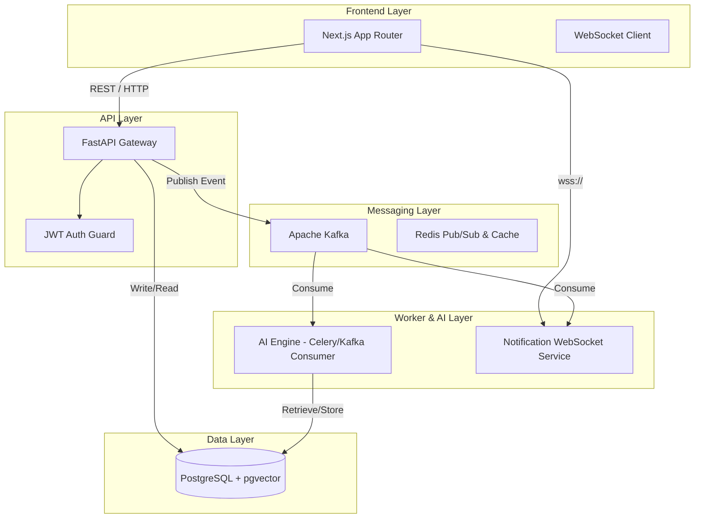
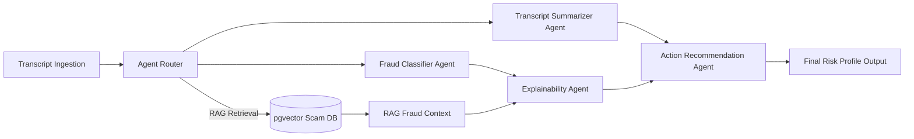
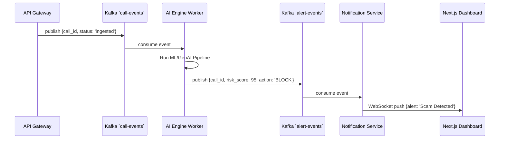

# Architecture Diagrams

These diagrams illustrate the enterprise event-driven architecture of the CallGuard AI platform.

## High-Level Architecture

## AI Multi-Agent Pipeline

## Kafka Event Flow

